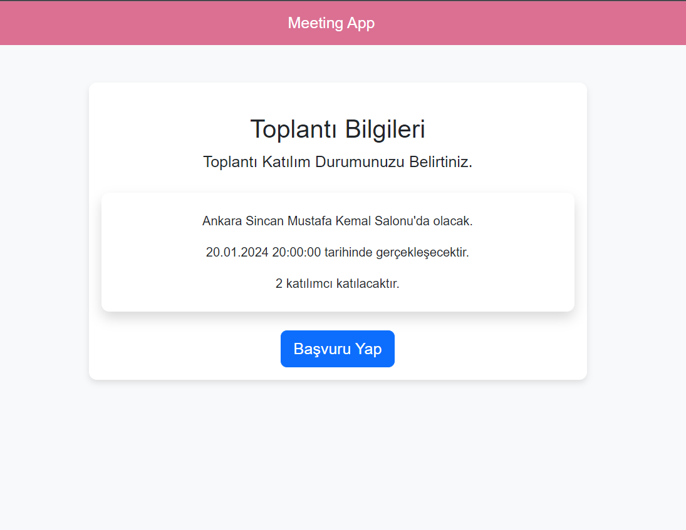
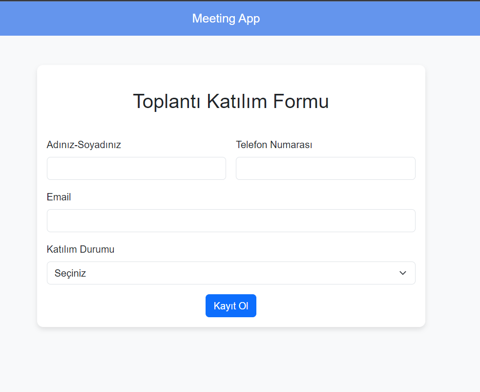
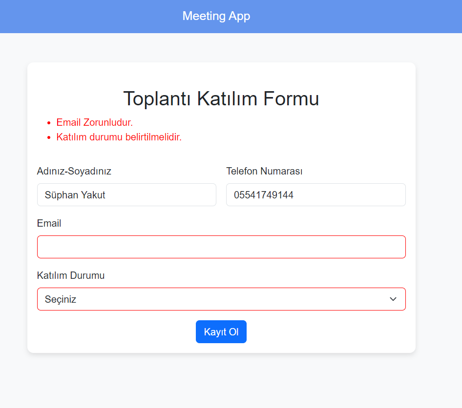
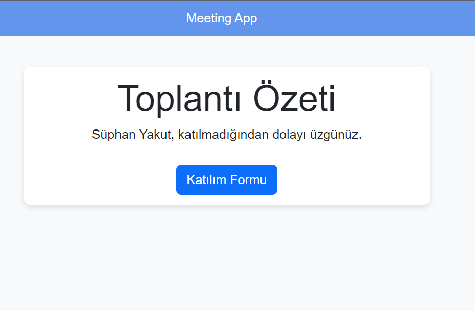
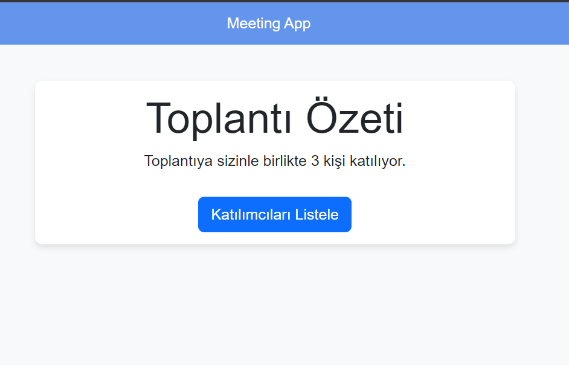
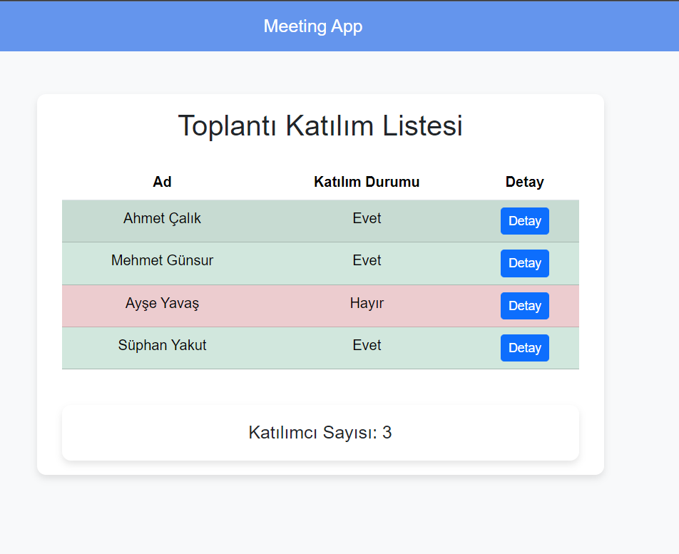
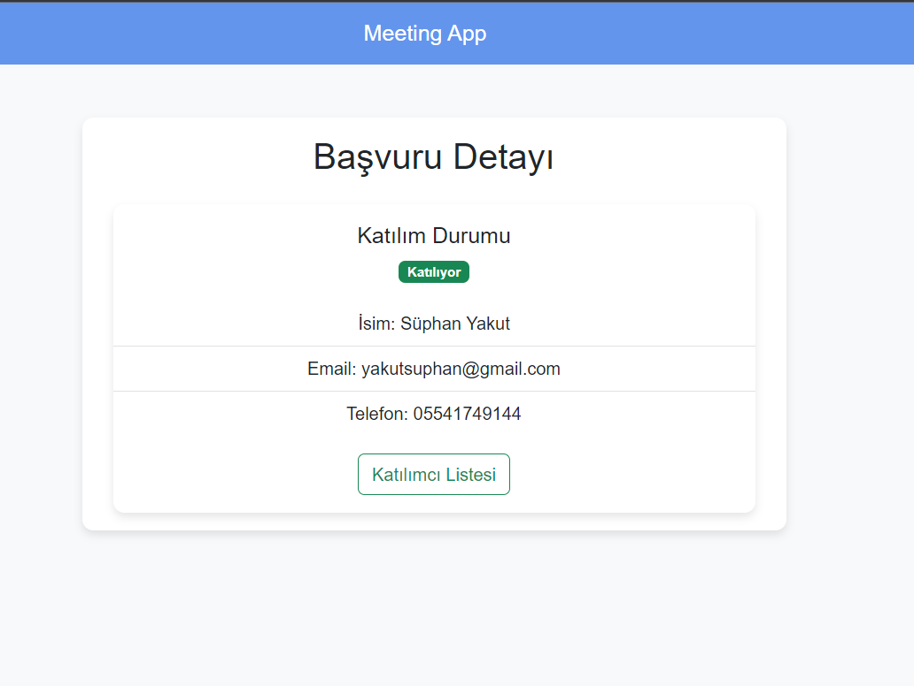
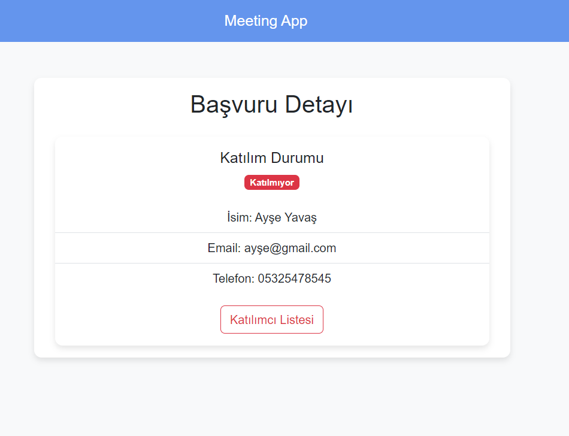

# Meeting App

Proje, .NET Core MVC kullanılarak geliştirilmiş bir web uygulamasıdır. Bu uygulama, bir etkinliğe katılacak olan katılımcılardan katılım durumları ve kişisel bilgileri toplamaktadır. Katılımcılar, formu doldurduktan sonra, eğer etkinliğe katılmayı seçmişlerse, diğer katılımcıları listeleyebilir ve onların detay sayfalarına erişebilirler. Ancak, katılmayı seçmemişlerse, teşekkür edilir ve katılım formuna yönlendirilirler.

The project is a web application developed using .NET Core MVC. This application collects participation statuses and personal information from participants who will attend an event. After filling out the form, participants who have chosen to attend the event can view and access the detail pages of other participants. However, if they choose not to attend, they are thanked and redirected to the participation form. (EN)

## Proje İçeriği - Project Content

- Empyt project
- Default Routing
- Controllers
- Views 
- Models
- Layout
- Client Packages- Libman
- Viewbag & ViewData
- Forms
- Model Binding
- Tag Helpers
- Form Validations

## Ekran Görüntüleri (Screenshots)

